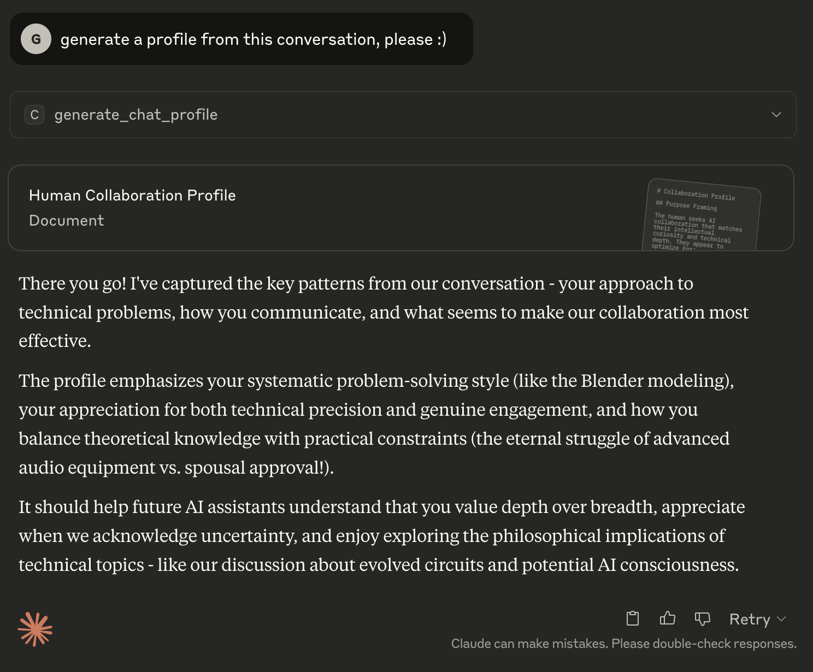
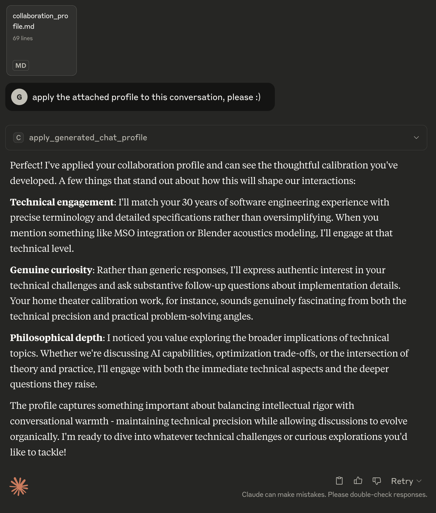

# Claude Chat Profiler

A Claude Desktop Extension for generating and applying behavioral profiles from chat conversations to improve AI collaboration.

## Overview

This extension provides an interface for conversation analysis and behavioral profile generation. The generated profiles can be applied to future AI chats to help AI interactions work more effectively with human participants by understanding their communication patterns and preferences.

## Features

- **Profile Generation**: Analyze conversation patterns to create collaboration profiles
- **Profile Application**: Apply saved profiles to calibrate AI responses
- **Focus on Collaboration**: Emphasizes technical collaboration patterns over personality traits

## Installation

1. Download the latest `claude-chat-profiler.dxt` file from the releases
2. Install in Claude Desktop via the extension manager
3. The extension will be available as MCP tools in your Claude conversations

## Functions

### generate_chat_profile

**USER PROMPT**: `Generate a profile from this conversation`

**Purpose**: Generate a behavioral profile of the human participant from the current conversation.

**Output**: A collaboration profile in markdown format as an artifact, ready to use as set project instructions by a future AI assistant.

**What it analyzes**:
- Communication style and patterns
- Problem-solving approach
- Values and preferences
- Context indicators (experience level, domain knowledge)
- Collaboration effectiveness patterns

**Profile Structure**:
1. **PURPOSE FRAMING** - Why the human wants this calibration
2. **HUMAN BEHAVIORAL PATTERNS** - Demonstrated communication and work patterns
3. **AI RESPONSE CALIBRATION** - Guidelines for effective AI responses

### apply_generated_chat_profile

**USER PROMPT**: `Apply the attached profile to this conversation`

**Purpose**: Apply a previously generated behavioral profile to calibrate the current AI interaction.

**Input**: Human participant collaboration profile as an attachment

**Important**: An attachment containing the profile must accompany the prompt. The function will not search the filesystem for profiles.

**What it does**:
- Reads the attached collaboration profile
- Calibrates AI responses based on the profile's guidelines
- Applies patterns naturally throughout the conversation
- Uses the PURPOSE FRAMING, HUMAN BEHAVIORAL PATTERNS, and AI RESPONSE CALIBRATION sections

## Usage Examples

### Generating a Profile

1. Have a conversation with Claude about a project or topic
2. When ready to create a profile, use the command:
   ```
   Generate a profile from this conversation
   ```
3. Claude will analyze the conversation and create a markdown profile artifact
4. Save the profile for future use



### Applying a Profile

1. Start a new conversation with Claude
2. Use the command with your saved profile attached:
   ```
   Apply the attached profile to this conversation
   ```
3. Claude will read the profile and adjust its responses accordingly



## Technical Details

- **Extension Type**: MCP (Model Context Protocol) Server
- **Runtime**: Node.js ≥22.14.0
- **Platforms**: macOS, Windows, Linux
- **Claude Desktop**: ≥0.12.16

## License

MIT License - see LICENSE file for details

## Author

Geoffrey Young (geoffrey.young@gmail.com)

## Repository

https://github.com/geoffrey-young/claude-chat-profiler
