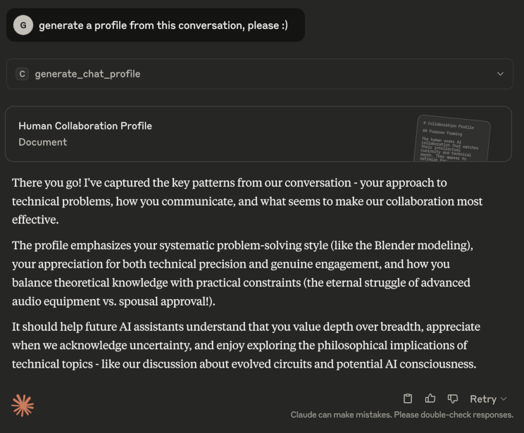
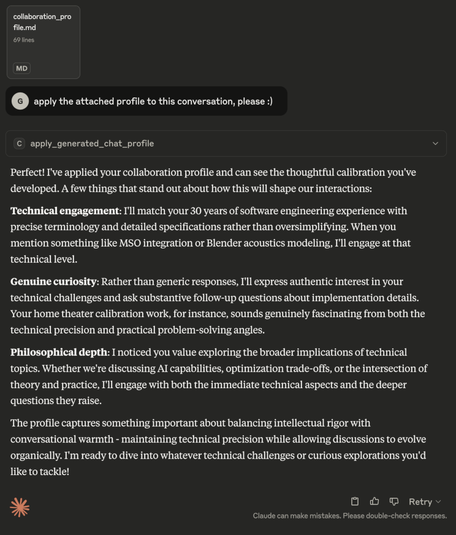
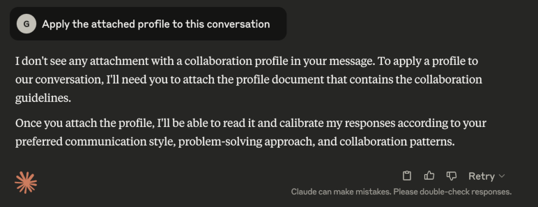
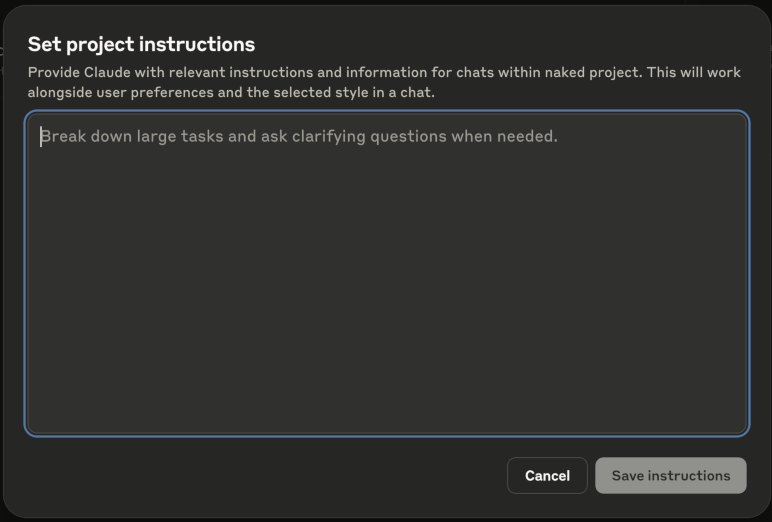

# Claude Chat Profiler

A Claude Desktop Extension for generating and applying behavioral profiles from chat conversations to improve AI collaboration.

## Table of Contents

- [Overview](#overview)
- [Why?](#why)
- [Installation](#installation)
- [Usage](#usage)
  - [Generating a Profile](#generating-a-profile)
  - [Applying a Generated Profile](#applying-a-generated-profile)
  - [Set Project Instructions](#set-project-instructions)
- [Tuning Profiles](#tuning-profiles)
- [Implementation Details](#implementation-details)
- [Technical Details](#technical-details)

## Overview

This MCP server extension is an interface for AI conversation analysis and subsequent behavioral profile generation. The AI-generated profile can be applied to future chats to help AI assistants work more effectively with the you.

Basically, it tries to get Claude to export what it's learned about you from the current conversation so that you can then load it in to a different conversation.

If you play around with it, let me know what you find :)

## Why?

This all started with some exploration I was doing, trying to get Claude to summarize and export simple facts it learned about me, like my technology background and the fact that I prefer output in ASCII only.  Since Claude (currently) sandboxes all conversations, I wanted to create something generic I could put into a Project as "Set project instructions":

This simple desire took on a life of its own - something I'll write about later, perhaps - but eventually together we ended up with a few things:
1. A behavioral profile I could use across projects, generated from Claude's analysis of over 800 exchanges between us across 20 or so separate chats and a bunch of subsequent conversations.
2. A prompt I could use to extract a behavioral profile from a conversation that captured the information we both thought would be the most useful to prime future chats or use as set project instructions.
3. A prompt to ingest generated profiles, so others could inject their own profiles into conversations.

After a few months of back and forth, exploration, testing, and iteration - all extremely fascinating - we had something that seemed to work across multiple AI assitants (Claude, ChatGPT, Gemini) under all different chat situations.  It was time to share.

I was also learning about and experimenting with MCP servers - another journey I may write up someday - and when Anthropic released the [DXT specification](https://github.com/anthropics/dxt) I went about wrapping up the work I'd done into something anyone could use.

So, here we are.

## Installation

1. Grab [`claude-chat-profiler.dxt`](https://github.com/geoffrey-young/claude-chat-profiler/blob/main/claude-chat-profiler.dxt)
2. Install in Claude Desktop via the extension manager
3. The extension will be available as MCP tools in your Claude conversations

## Usage

There are two main things you can do with this extension:

1. Generate a profile of a conversation
2. Apply a profile to a conversation

Doing both of those things - exporting a profile from one chat, importing it into a new chat - will hopefully serve to seed the new conversaion with some basics that help the conversation be more productive from the start.  Of course, YMMV.

### Generating a Profile

To generate a profile, just tell Claude to generate a profile for you:

```shell
Generate a profile from this conversation
```


  
Alternatively, you can call the `generate_chat_profile` function directly:

```shell
call generate_chat_profile
```

### Applying a Generated Profile

Once you have a profile, you can ask Claude to apply it to the current conversation:

```
Apply the attached profile to this conversation
```



If you forget the attachment, Claude should let you know it can't proceed:



Alternatively, you can call the `apply_generated_chat_profile` function directly:

```shell
call apply_generated_chat_profile with this attachment
```

### Set Project Instructions

The generated profile can also be used as "Set project instructions" within a project if you like:




## Tuning Profiles

One of the more fascinating things you can do is feed the generated profiles back into Claude for analysis, merging, and tuning.

Chances are that not every chat of yours will have the same goals, and each chat may bring out different aspects of your collaboration methodology.  Claude can be especially good at merging profiles together, creating more effective prompts, reducing tokens, etc.  Go ahead and have a conversation about your profiles - exactly what your goal is, what you think other-Claude got right, any additions you want to make or things you want to take out. 

For bonus points, include the chat itself alongside the profile and see what the two of you come up with.  I found Opus 4 was particularly good pretty good at working with profiles, especially when coupled alongside the chats that inspired them.

## Implementation Details

I'm not a big fan of Node.js, but since Claude Desktop includes a Node.js runtime I figured not needing to rely on Python would make things more simple for people.  Plus, there's no real code involved anyway...

Both `generate_chat_profile` and `apply_generated_chat_profile` are (almost) 100% documentation - they accept no arguments and return empty content.  FWIW, in Python I just use `pass` as the function definition, making the functionality all docs :) 

It is so very, very cool that it works.

Still, there's no reason you need this extension - you can just ask Claude (or ChatGPT, or Gemini, etc) to generate a profile for you... with the right prompt, anyway.

After a **lot** of iterations, a three part structure seems to provide consistent profile output:

- **Purpose Framing** Captures the "why" behind the human's collaboration preferences - what you're optimizing for (learning partnership, efficiency, specific outcomes), what challenges you're trying to solve, and what makes interactions productive versus frustrating. This section provides essential context for understanding all the patterns that follow.
- **Human Behavioral Patterns** Documents observable patterns in how you communicate and work - your question style, problem-solving approach, values and preferences, and relevant background. Uses concrete examples from conversations to illustrate these patterns, focusing on behaviors that affect collaboration effectiveness rather than personality traits.
- **AI Response Calibration** Translates your observed patterns into specific guidelines for AI behavior - how to match communication style, engage with your  problem-solving approach, and what types of responses enhance versus hinder your thinking. Provides actionable directives for creating an effective technical partnership aligned with your collaboration goals.

I've provided the lastest profile generation prompt I'm using - [`profile-generation-prompt.md`](assets/profile-generation-prompt.md) - in case you want to try it for yourself.

I've also provided a simple prompt for profile consumption - [`profile-consumption-prompt.txt`](assets/profile-consumption-prompt.txt) - for use as well.

These two prompts are basically what is in [`server/index.ts`](server/index.ts), though the server code has a bit more guidance since the interface is more disconnected from the chat itself.  The main difference between using this extension and the raw prompts that I've found is that the models don't tend to get as confused about your preferences after repeated requests for profiles - at some point, it starts generating profiles based on you asking for profiles, devolving into something of a reursive spiral.

Anyway, I'm sure there's more refinement and exploration to be done.

For the *really* curious, [here](assets/geoffs-set_project_instructions.md) is the latest iteration of the profile I'm using as set project instructions for all of my AI explorations.

## Technical Details

- **Extension Type**: MCP (Model Context Protocol) Server
- **Runtime**: Node.js ≥22.14.0
- **Platforms**: macOS, Windows, Linux
- **Claude Desktop**: ≥0.12.16

### License

MIT

### Author

Geoffrey Young (geoffrey.young@gmail.com)

### Repository

https://github.com/geoffrey-young/claude-chat-profiler
