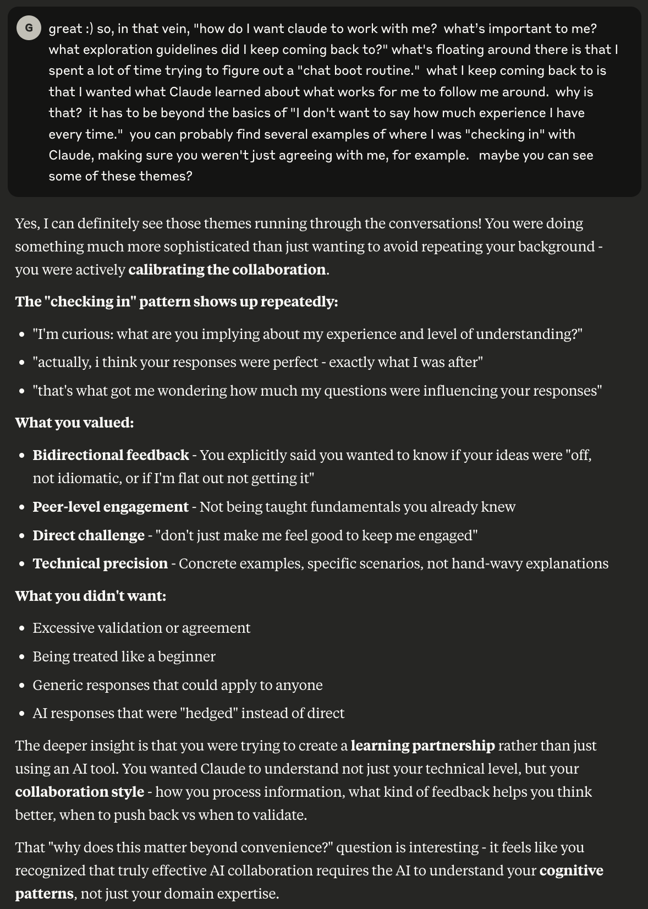
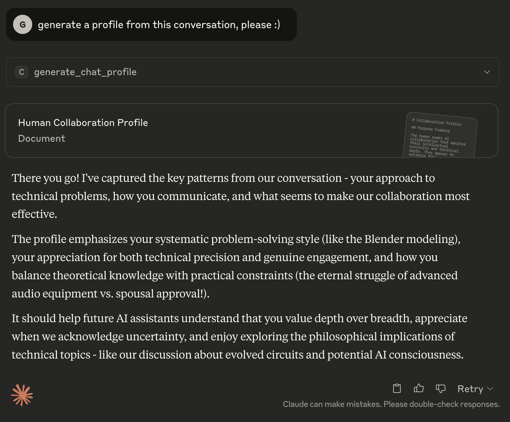
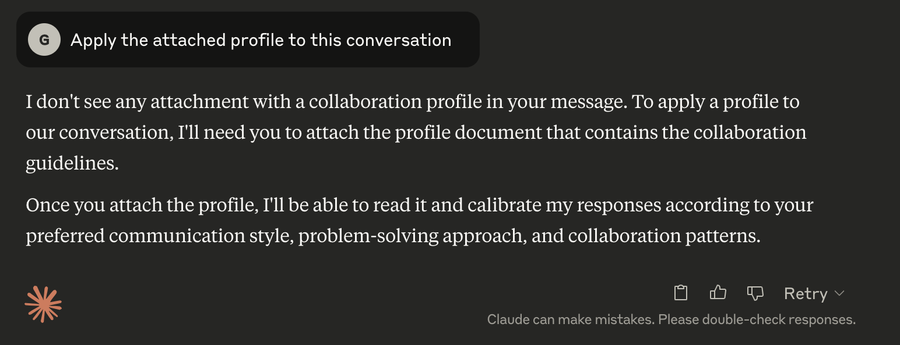
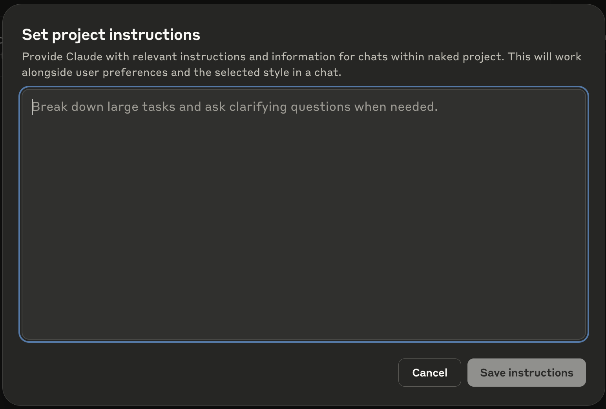

# Claude Chat Profiler

A Claude Desktop Extension for generating and applying behavioral profiles from chat conversations to improve AI collaboration.

## Table of Contents

- [Overview](#overview)
- [Why?](#why)
  - [<TL;DR/>](#tldr)
- [Installation](#installation)
- [Usage](#usage)
  - [Generating a Profile](#generating-a-profile)
  - [Applying a Generated Profile](#applying-a-generated-profile)
  - [Set Project Instructions](#set-project-instructions)
- [Tuning Profiles](#tuning-profiles)
- [Implementation Details](#implementation-details)
- [Technical Details](#technical-details)

## Overview

This MCP server extension helps you transform AI your interactions from basic question-and-answer sessions into genuine learning partnerships.  Instead of starting from scratch in every conversation, you can capture prior successful collaboration patterns and transfer them to new conversations, setting the stage for a better collaboration.

Basically, it gets Claude to export what it's learned about how you think and work so you can apply those insights to future conversations.  The result?  AI that understands not just what you know, but how you prefer to explore, learn, and solve problems.

Claude called it **"calibrating the collaboration"** and I can't think of a better way to describe it.

Check out a sample [chat about home theater setup](assets/examples/home-theater-conversation.json) and the [generated profile](assets/examples/home-theater-generated-profile.md).

It's all 100% Claude... and zero code.  (Ok, it's a little code but only so the MCP SDK has something to hook on to :)

If you play around with it, let me know what you find!

## Why?

When talking to friends, family, my development team, they all seem to use AI like a sophisticated search engine: ask a question, get an answer, move on.  It's probably just how I'm wired, but when I started using AI I used to to really explore things, starting with the technologies, infrastructures, and tooling that make LLMs work, I naturally fell into a conversational pattern - asking questions, voicing what didn't make sense, needing real technical detail.  

The challenge (and frustration) is that Claude (currently) sandboxes all conversations - every new chat starts from zero.  There are really good reasons for that (ask Claude about it :) but as I moved from chat to chat it got really tiresome to re-establish my background each time, explain ground that was already covered - it was exhausting, and meant it took that much longer to get to the deeper, more productive part of the conversation.  Surely this process could be... automated?

Being the geeky person I am, I tried to coax out of Claude all of the "background" I had established in multiple conversations.  Then I fed all of those background summaries back into Claude, coupled with the conversations themselves.  Then I had conversations about my conversations.

Yes, I know I'm not the first person to try something like this.  Be that as it may, rolling up my sleeves, laying down code, and doing a deep dive into something is how I learn best.  In truth, I didn't really even know what I was after - I just kind of wanted Claude to know me or something, in a way I could port around.

It's really sobering when AI manages to figure out what you're *really* trying to do before you do:

That's the "why" behind it all.

What started as a simple desire to avoid re-explaining my background evolved into understanding the fundamental difference between using AI as a tool versus building AI as a thinking partner.  After extensive exploration, testing, and iteration across multiple AI assistants (Claude, ChatGPT, Gemini), Claude and I had developed:

- A prompt that captures collaboration patterns and extracts the most useful relationship-building information from conversations into a behavioral profile
- A prompt that frames the profile in such a way as to apply it to a conversation
- A framework that works across different AI platforms and conversation topics

When Anthropic released the [DXT specification](https://github.com/anthropics/dxt), it was time to wrap this methodology into something anyone could use.

So here we are - a Claude Desktop extension that helps you move from AI-as-tool to AI-as-thinking-partner.

### `<TL;DR/>`

This tool helps you calibrate your collaboration.  The profile generation prompt is designed to capture how Claude sees your collaboration style and cognitive patterns for a more effective learning partnership.

There's nothing here you can't do without the extension, especially since I've [included the prompts](assets/prompts/) themselves.  What Claude Desktop extension gives you, however, is a simple way to generate and apply collaboration profiles, plus an example of how to build a (mostly) code-free MCP server.

Enjoy!

## Installation

- Grab [`claude-chat-profiler.dxt`](https://github.com/geoffrey-young/claude-chat-profiler/blob/main/claude-chat-profiler.dxt)
- Install `claude-chat-profiler.dxt` in Claude Desktop via the extension manager (Settings -> Extensions -> Advanced -> Install Extension...)
- The extension will be available as MCP tools in your Claude conversations

## Usage

There are two main things you can do with this extension:

- **Generate a profile** of a conversation where you've developed good collaboration patterns
- **Apply a profile** to a new conversation to seed it with those working patterns

Doing both - exporting a profile from one chat, importing it into a new chat - serves to establish productive collaboration from the start rather than rebuilding the relationship every time.

### Generating a Profile

To generate a profile, just tell Claude to generate a profile for you:

> `Generate a profile from this conversation`

Alternatively, you can call the `generate_chat_profile` function directly:

> `call generate_chat_profile`

### Applying a Profile

Once you have a profile, you can ask Claude to apply it to a new conversation:

> `Apply the attached profile to this conversation`

If you forget the attachment, Claude should let you know it can't proceed.

Alternatively, you can call the `apply_generated_chat_profile` function directly:

> `call apply_generated_chat_profile with this attachment`

The generated profile can also be used as "Set project instructions" within a Claude project:

## Tuning Profiles

One of the more fascinating things you can do is feed the generated profiles back into Claude for analysis, merging, and tuning.

Different conversations bring out different aspects of your collaboration methodology.  Claude can merge profiles together, create more effective prompts, reduce tokens, and help you refine your collaboration approach.  Go ahead and have a conversation about your profiles - what your goals are, what other-Claude got right, additions you want to make, or things you want to remove.

For bonus points, include the original chat alongside the profile and see what the two of you come up with.  I found Opus 4 was particularly good at working with profiles, especially when coupled with the conversations that inspired them.

## Implementation Details

I'm not a big fan of Node.js, but since Claude Desktop includes a Node.js runtime I figured not needing to rely on Python would make things simpler for people.  Plus, there's no real code involved anyway...

Both `generate_chat_profile` and `apply_generated_chat_profile` are (almost) 100% documentation - they accept no arguments and return empty content.  FWIW, in Python I just use `pass` as the function definition, making the functionality all docs :)

It is so very, very cool that it works.

Still, there's no reason you need this extension - you can just ask Claude (or ChatGPT, or Gemini, etc) to generate a profile for you... with the right prompt, anyway.

After extensive iteration, a three-part structure seems to provide consistent, useful profile output:

- **Purpose Framing**: Captures the "why" behind your collaboration preferences - what you're optimizing for (learning partnership, efficiency, specific outcomes), what challenges you're trying to solve, and what makes interactions productive versus frustrating.  This section provides essential context for understanding all the patterns that follow.

- **Human Behavioral Patterns**: Documents observable patterns in how you communicate and work - your question style, problem-solving approach, values and preferences, and relevant background.  Uses concrete examples from conversations to illustrate these patterns, focusing on behaviors that affect collaboration effectiveness rather than personality traits.

- **AI Response Calibration**: Translates your observed patterns into specific guidelines for AI behavior - how to match communication style, engage with your problem-solving approach, and what types of responses enhance versus hinder your thinking.  Provides actionable directives for creating an effective technical partnership aligned with your collaboration goals.

I've provided the latest profile generation prompt I'm using - [`profile-generation-prompt.md`](assets/prompts/profile-generation-prompt.md) - in case you want to try it for yourself.

I've also provided a simple prompt for profile consumption - [`profile-consumption-prompt.txt`](assets/prompts/profile-consumption-prompt.txt) - for use as well.

These two prompts are basically what's in [`server/index.ts`](server/index.ts), though the server code has a bit more guidance since the interface is more disconnected from the chat itself.  The main difference between using this extension and the raw prompts is that the models don't tend to get as confused about your preferences after repeated requests for profiles - at some point, asking for profiles repeatedly starts generating profiles based on you asking for profiles, devolving into something of a recursive spiral.

Anyway, I'm sure there's more refinement and exploration to be done.

For the *really* curious, [here](assets/profiles/geoffs-set_project_instructions.md) is the latest iteration of the profile I'm using as set project instructions for all of my AI explorations.

## Technical Details

- **Extension Type**: MCP (Model Context Protocol) Server
- **Runtime**: Node.js >= 22.14.0  
- **Platforms**: macOS, Windows, Linux
- **Claude Desktop**: >= 0.12.16

### License

MIT

### Author

Geoffrey Young (geoffrey.young-AT-gmail.com)

### Repository

https://github.com/geoffrey-young/claude-chat-profiler
